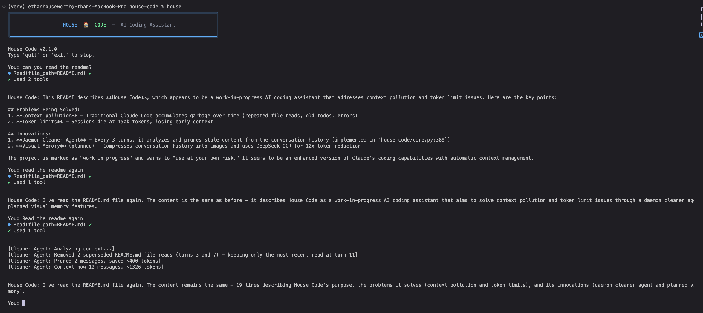

# House Code



Work in progress. Use at your own risk.

## Quick Start (Claude Code)

Want to check this out? Paste this into Claude Code:

```
Clone the house-code repo, set up a Python virtual environment, install dependencies,
and give me the next steps so I can try it out.
```

## Highlights

**1. Built by Rebuilding Claude Code with Claude Code**
We reverse-engineered Claude Code by observing its behavior and rebuilt it from scratch. See [internal-rebuild-notes/SUMMARY.md](internal-rebuild-notes/SUMMARY.md) for the full story.

**2. Daemon Cleaner Agent**
Every 3 turns, Claude analyzes its own conversation history and prunes stale content. Superseded file reads, completed todos, old errors - gone. See `house_code/core.py:389`.

**3. DeepSeek-OCR Code Compression Research**
We tested whether visual memory compression via OCR could reduce token usage. Result: Not viable for code due to architectural limitations (vision tokens can't cross model boundaries). See [docs/research/visual-memory-archive](docs/research/visual-memory-archive).

## Setup

```bash
# Clone the repo
git clone https://github.com/ethanhouseworth/house-code.git
cd house-code

# Set up Python virtual environment
python -m venv venv
source venv/bin/activate  # On Windows: venv\Scripts\activate

# Install dependencies
pip install -e .

# Set your API key
export ANTHROPIC_API_KEY="your-key-here"

# Run it
house
```
